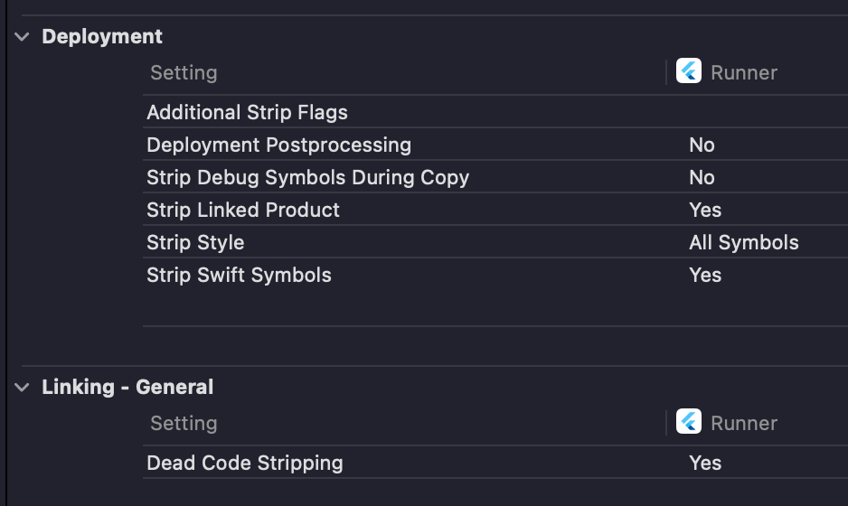

# sentry_no_errors_repro

- Minimal sentry setup
- Cocoapods
- captureError when + is pressed

## Main

Implicit Strip Settings (No values set in projec.pbxproj)

### Release

- `flutter run --release`
- run and press '+' -> Shoud see issue on sentry.io

### IPA

- `flutter build ipa --release --export-method development`
- `ios-deploy --bundle build/ios/ipa/sentry_no_errors_repro.ipa`
- run and press '+' -> Shoud see issue on sentry.io

